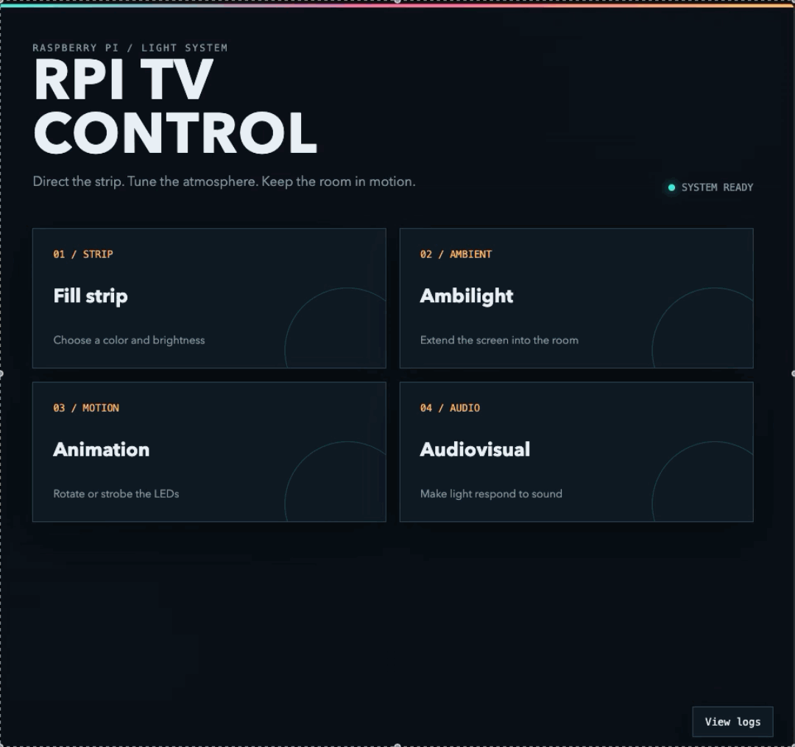

# Raspberry Pi TV 
Run your local webapp server to fully control rgb Leds in the back of your TV! You can use any device connected to your local network. 

## Install & start web server on RPI
`./install-rpitv.sh -H {USER@IP-ADDRESS-OF-RPI}` 

## Return status of service running on RPI
- via ssh: `ssh rptiv "systemctl status rpitv"`
- or from RPI directly: `systemctl status rpitv` 
- stop web server: `ssh rpitv "systemctl stop rpitv"` 